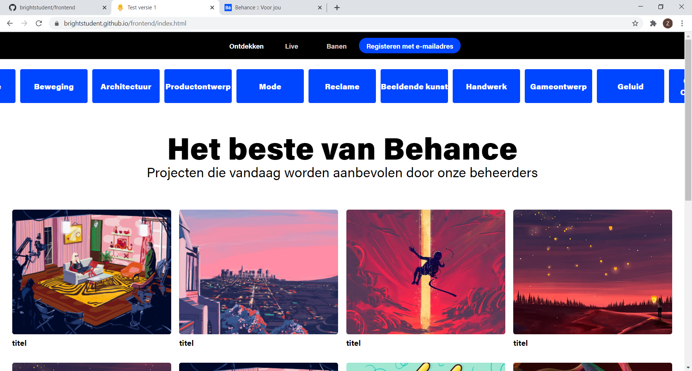
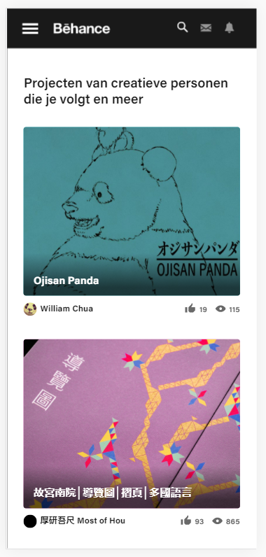
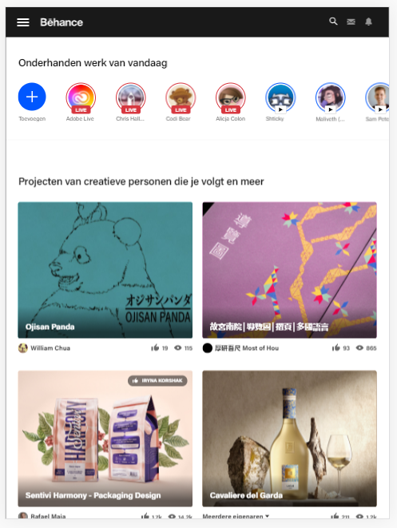

# Procesverslag
**Auteur:** Zaid El Boustani

Markdown cheat cheet: [Hulp bij het schrijven van Markdown](https://github.com/adam-p/markdown-here/wiki/Markdown-Cheatsheet). Nb. de standaardstructuur en de spartaanse opmaak zijn helemaal prima. Het gaat om de inhoud van je procesverslag. Besteedt de tijd voor pracht en praal aan je website.

## Bronnenlijst
1. -bron 1-
2. -bron 2-
3. -...-

## Eindgesprek (week 7/8)

-dit ging goed & dit was lastig-

**Screenshot(s):**

-screenshot(s) van je eindresultaat-

## Voortgang 3 (week 6)

-same as voortgang 1-

## Voortgang 2 (week 5)

**Wat ging goed:**
1. tekst overlay op de thumbnails tijdens de hover
2. ratio behouden tijdens het schalen
    
**Wat was lastig:**
1. croussel knoppen maken om te navigeren
2. active link in de carossel in het midden centreren
3. menu laten collapsen (hamburgermenu) op kleinere schermen

## Voortgang 1 (week 3)

### Stand van zaken

**Wat ging goed:**
1. responsive maken van de website
2. het gebruiken van de grid voor het eerste keer
    
**Wat was lastig:**
croussel maken
script toevoegen

**Screenshot(s):**

### Agenda voor meeting

-samen met je groepje opstellen-

### Verslag van meeting

-na afloop snel uitkomsten vastleggen-

## Intake (week 1)

**Je startniveau:** Rood

**Je focus:** Responsive

**Je opdracht:** https://www.behance.net/

**Screenshot(s):**

**Breakdown-schets(en):**

