# Procesverslag

**Auteur:** Zaid El Boustani

Markdown cheat cheet: [Hulp bij het schrijven van Markdown](https://github.com/adam-p/markdown-here/wiki/Markdown-Cheatsheet). Nb. de standaardstructuur en de spartaanse opmaak zijn helemaal prima. Het gaat om de inhoud van je procesverslag. Besteedt de tijd voor pracht en praal aan je website.

## Bronnenlijst

1. https://css-tricks.com/aspect-ratio-boxes/
1. https://css-tricks.com/almanac/selectors/a/after-and-before/
1. https://www.w3schools.com/css/css3_object-fit.asp
1. https://stackoverflow.com/questions/52578726/fontawesome-5-multi-color-icon
1. https://fontawesome.com/icons/google?style=brands
1. https://stackoverflow.com/questions/7993067/text-overflow-ellipsis-not-working
1. https://flickity.metafizzy.co/style.html

## Eindgesprek (week 7/8)

**Wat ging goed:**

1. Het maken van animaties
1. Het vastzetten van mijn navigatiebalk. Hiervoor heb ik de property `postition: sticky;` gebruikt.

**Wat was lastig:**

1. De carousel zelf realiseren was niet te doen. Ik heb uiteindelijk gebruik gemaakt van flickty (zie bron 7)
1. Het gedrag van de sticky zoekbalk aanpassen met Javascript
1. Dropdown menus maken voor de zoekbalk in pagina 2

**Screenshot(s):**

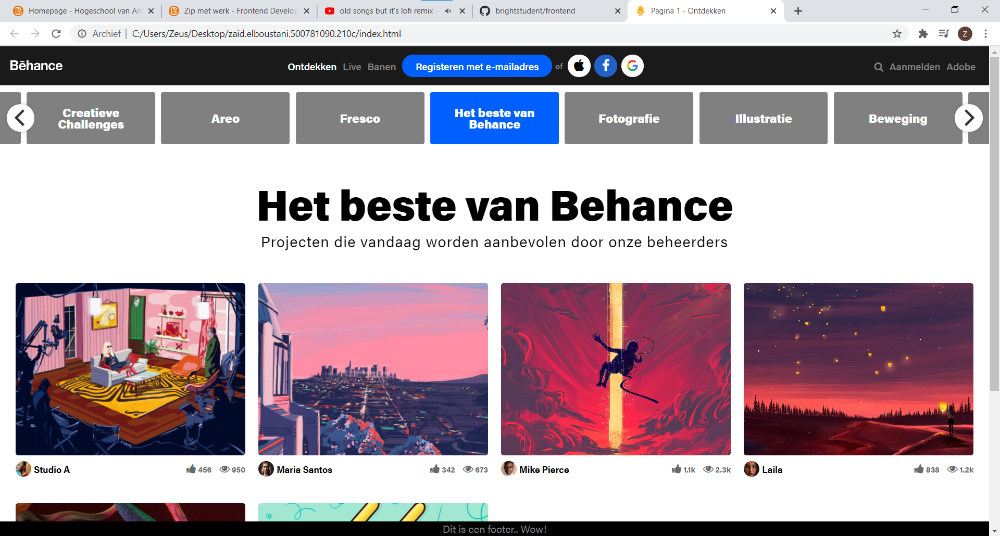
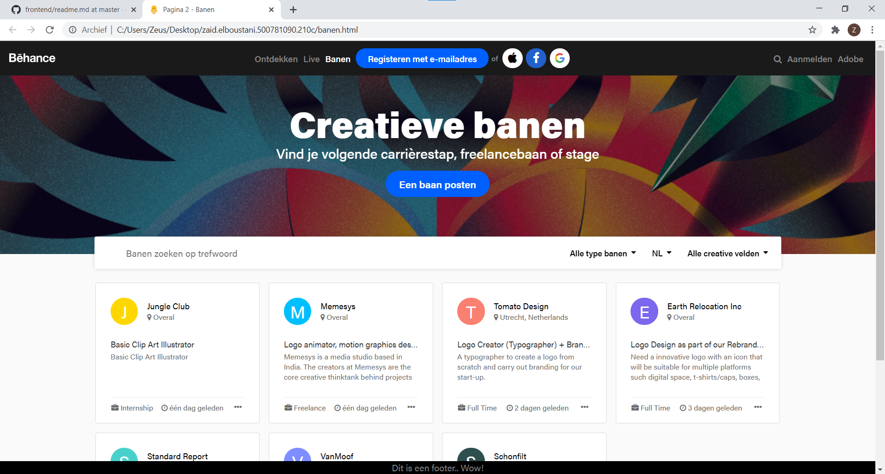
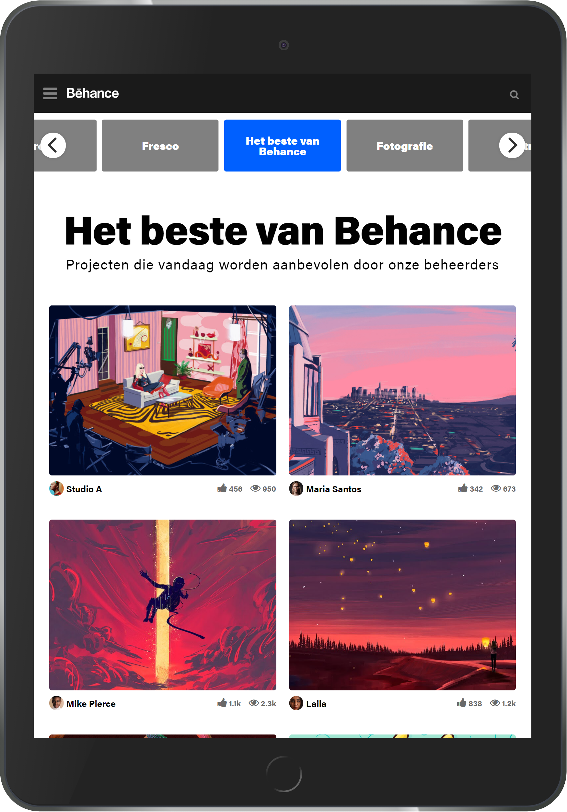
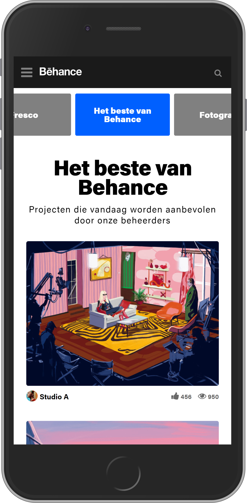

## Voortgang 3 (week 6)

**Wat ging goed:**

1. Het maken van de responsive hamburgermenu for mobiel.

**Wat was lastig:**

1. nvt

**Screenshots:**

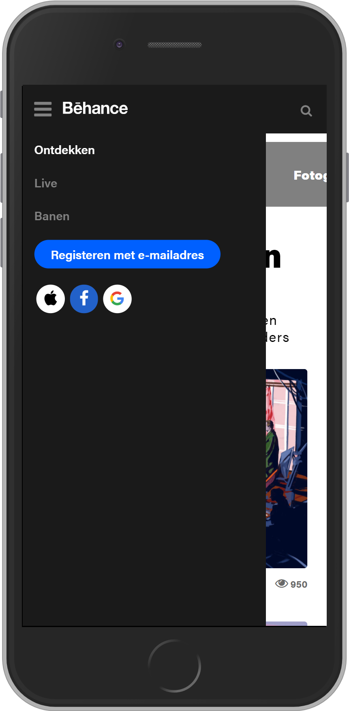

## Voortgang 2 (week 5)

**Wat ging goed:**

1. tekst overlay op de thumbnails tijdens de hover
1. ratio behouden tijdens het schalen

**Wat was lastig:**

1. croussel knoppen maken om te navigeren
1. active link in de carossel in het midden centreren
1. menu laten collapsen (hamburgermenu) op kleinere schermen
1. over het algemeen zijn de menu balken het moeilijkste gedeelte

**Screenshots:**

```CSS
.thumbnail {
    position: relative;
}

.thumbnail:after {
    content: '';
    display: block;
    padding-bottom: calc(100% / (4/3));
}
```

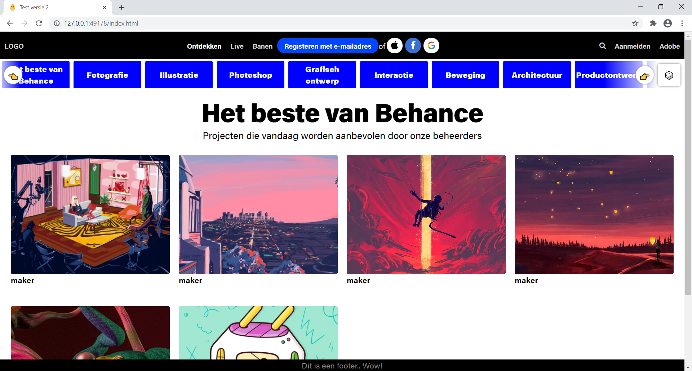

<!-- 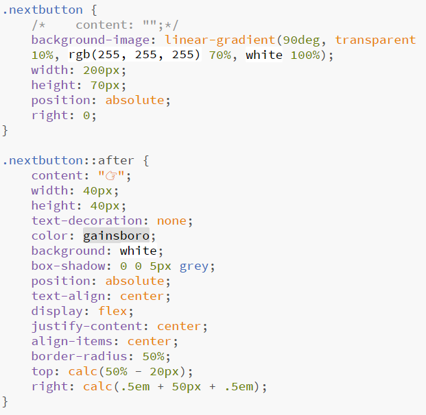 -->

### Agenda voor meeting

| Merel | Renzo                                           | Sietse                             | Zaid                                            |
| ----- | ----------------------------------------------- | ---------------------------------- | ----------------------------------------------- |
| nvt   | Animatie hamburger, menu talenkeuze en inloggen | Flexbox en een hamburgermenu maken | Navigeren met een klikbutton binnen de carousel |

## Voortgang 1 (week 3)

### Stand van zaken

**Wat ging goed:**

1. responsive maken van de website
1. het gebruiken van de grid voor het eerste keer

**Wat was lastig:**

1. croussel maken
1. script toevoegen

**Screenshot(s):**


### Agenda voor meeting

| Merel             | Renzo                   | Sietse     | Zaid                                                 |
| ----------------- | ----------------------- | ---------- | ---------------------------------------------------- |
| Background images | Interval met Javascript | Javascript | Vaste aspect-ratio en tekst overlay tijdens de hover |

### Verslag van meeting

Tijdens de meeting hebben we het gehad over tekst overlay boven de plaatjes. Hiervoor heb ik de tip gekregen om een article element te gebruiken in plaats van een section met daarin een div voor de foto.

## Intake (week 1)

**Je startniveau:**

- [] Blauw
- [x] Rood
- [] Zwart

**Je focus:**

- [x] Responsive
- [] Surface plane

**Je opdracht:**
https://www.behance.net/

**Screenshot(s):**

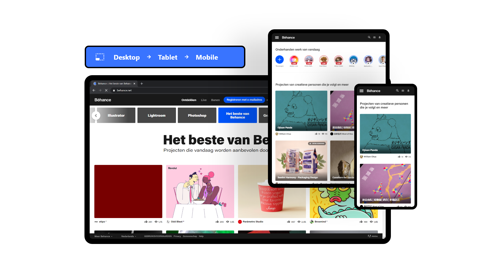

<!-- 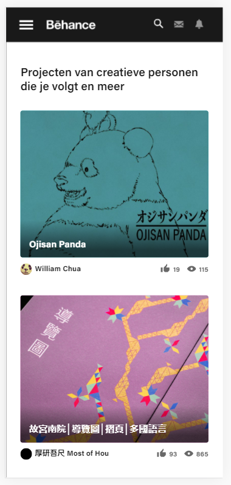
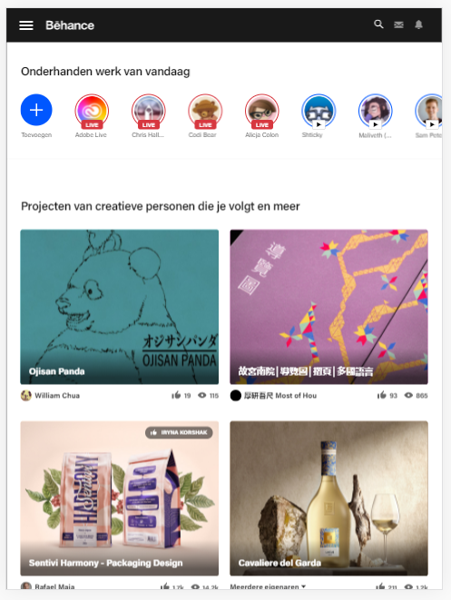
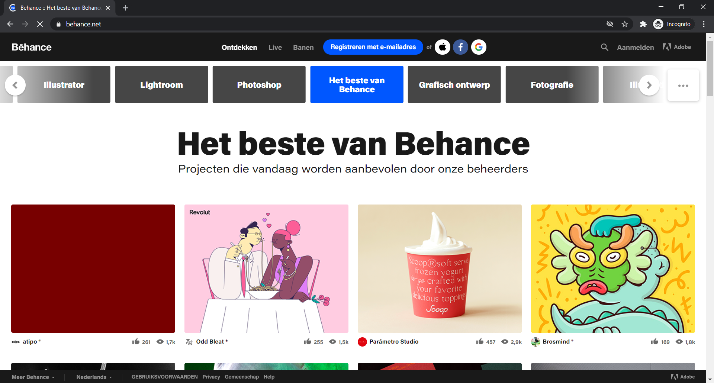 -->

**Breakdown-schets(en):**

